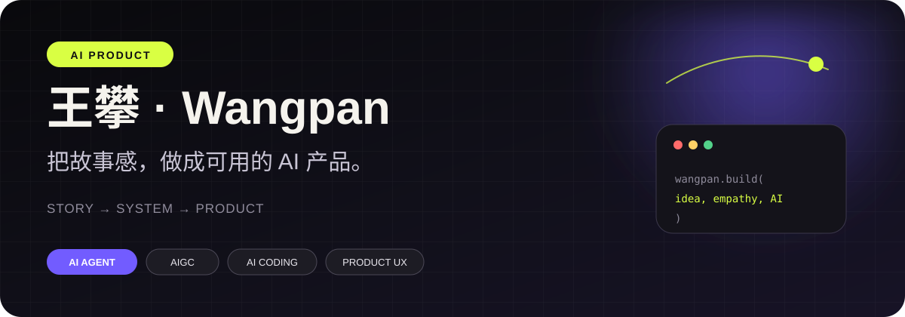

# Hi, I'm Wangpan 👋

### 把故事感，做成可用的 AI 产品。

广播电视编导背景的 AI 产品经理。  
我用导演思维理解用户、情绪与体验，用产品方法把复杂技术变成真实场景。

---

## About me

我关注的不只是“模型能做什么”，而是：

- **谁**会在什么时刻使用它；
- 它如何减少用户的理解与判断成本；
- 怎样让技术能力变成清晰、可信、愿意持续使用的体验。

目前聚焦 **AI Agent、AIGC 创作工具、Prompt / RAG、AI Coding 与模型体验评测**。  
从需求拆解、产品定义到可交互原型，我喜欢把模糊想法快速做成可以验证的产品。

## Selected work

| Project | What it solves |
| --- | --- |
| **[DSH Pet Voice](https://github.com/pwang7874-crypto/deepseekharness-)** | 会陪伴、会行动的系统级 AI 桌宠。把 Agent 的会话与任务事件变成置顶桌宠、语音、动画和原生通知。 |
| **[Human Writing](https://github.com/pwang7874-crypto/comic-human-writing)** | 为中文内容找回“人味”的 ChatGPT / Codex Skill，用材料、追问、观点碰撞与文风检查改善模型腔。 |
| **[MUSE](https://pwang7874-crypto.github.io/pwang7874-crypto/#work)** | 审美先于参数的 AIGC 生图平台，让非专业创作者把模糊的视觉感觉转化为可控成片。 |
| **[别穿帮](https://pwang7874-crypto.github.io/pwang7874-crypto/#work)** | 剧组自然光连续性助手，把光线变化从片场经验变成可计算、可预警的拍摄决策。 |

## Evidence

<pre>
35 条垂类内容交付       6,772+ 真实用户点赞
30+ 本地商户协作        961 垂类账号粉丝
</pre>

- 中国大学生广告艺术节学院奖：两次优秀奖、两次入围奖
- 全国大学生数字编辑创新大赛：二等奖
- 河南省“读懂中国”微视频：一等奖
- 校微电影节：最佳视觉效果奖

## Product toolkit

  
  
  
  
  
  
  
  

<strong>GitHub activity</strong>

 

  
  

---

**Story → System → Product**

[View the full portfolio](https://pwang7874-crypto.github.io/pwang7874-crypto/) · [Start a conversation](mailto:13069582552@163.com)

